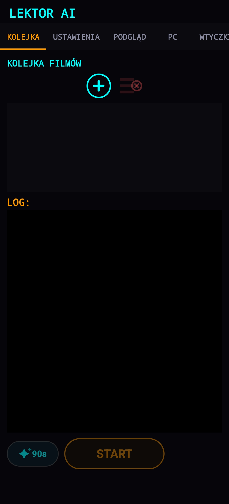
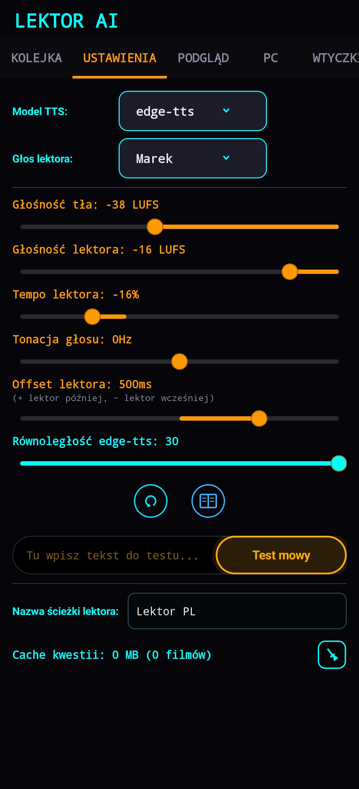
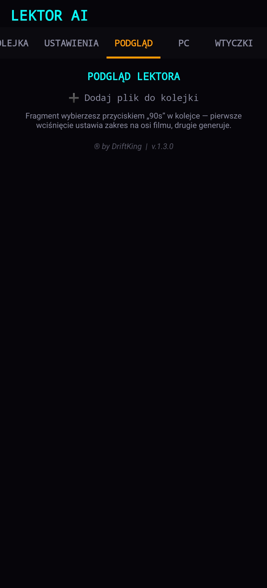
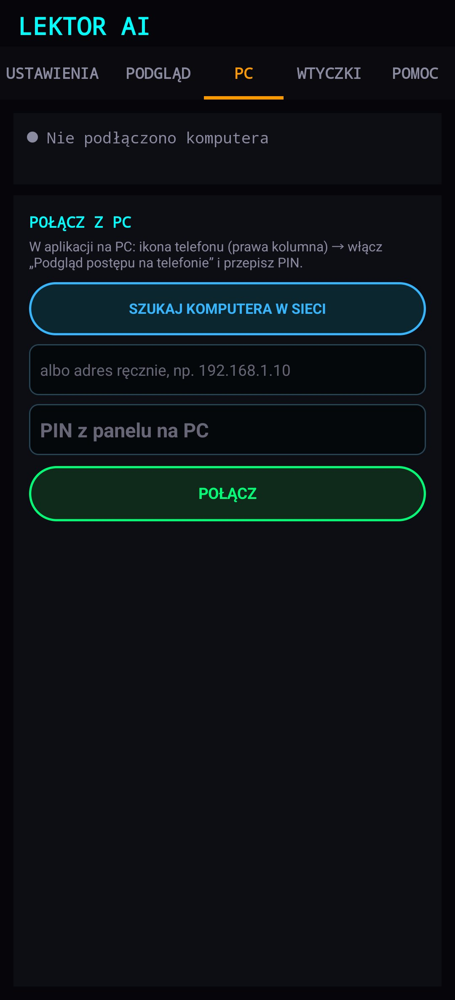

### **Dołącz do mojego Serwera:**

  

<h3 align="center">Lektor AI Mobile</h3>

  

  
  
  

### 🤖 O projekcie
Mobilna wersja programu **[Lektor AI](https://github.com/gangg111/Lektor_AI)** to ta sama idea, tylko w kieszeni. Aplikacja bierze film z napisami, generuje z nich naturalnie brzmiący głos lektora po polsku i miksuje go z oryginalną ścieżką, zachowując synchronizację z czasami napisów. Wszystko dzieje się na telefonie: kolejka filmów, generowanie mowy, montaż i zapis gotowego pliku.

Druga połowa aplikacji to **pilot do wersji na komputer**: zakładka „PC" pokazuje na żywo kolejkę, fazę renderu, ETA i log z Lektora AI na PC, a przyciskiem START/STOP sterujesz nim z kanapy albo zza miasta.

### 📸 Interfejs aplikacji
Poniżej zrzuty ekranu z działającej aplikacji:

  
  
  
  

  <b>Kolejka</b> - filmy do przetworzenia i log &nbsp;·&nbsp; <b>Ustawienia</b> - głos, głośności, tempo, offset &nbsp;·&nbsp; <b>Podgląd</b> - odsłuch fragmentu &nbsp;·&nbsp; <b>PC</b> - łączenie z komputerem i pilot

### 🚀 Funkcje
* **Głosy neuronowe**: Microsoft Edge-TTS oraz OpenAI TTS, ten sam dobór głosów co w wersji na komputer.
* **Kolejka filmów**: dodajesz kilka plików i lecą po kolei; log na bieżąco mówi, co się dzieje.
* **Pełna kontrola brzmienia**: głośność lektora i tła (LUFS), tempo, tonacja, offset względem napisów.
* **Podgląd „90s"**: zanim puścisz cały film, generujesz krótki fragment i słuchasz, czy ustawienia grają.
* **Słownik wymowy**: własne zamiany fonetyczne dla nazw, które lektor czyta źle; można pobrać słownik z komputera.
* **Zakładka PC (pilot)**: podgląd renderu na komputerze w czasie rzeczywistym, kolejka z miniaturami, log i zdalny START/STOP.
* **Podgląd także poza domem**: w sieci domowej połączenie jest bezpośrednie, a poza nią leci szyfrowanym tunelem; gdy komputer jest niedostępny, dostajesz powiadomienia o starcie, kolejnych plikach, końcu i błędach.

### 📲 Instalacja
1. Pobierz plik **APK** z sekcji **[Releases](https://github.com/gangg111/Lektor_AI_Mobile/releases)**.
2. Otwórz go na telefonie i potwierdź instalację z nieznanego źródła (Android zapyta raz).
3. Wymagany Android **8.0 (API 26)** lub nowszy.

### 🔗 Połączenie z wersją na komputer
1. W Lektorze AI na PC kliknij **ikonę telefonu** w prawej kolumnie i włącz **„Podgląd postępu na telefonie"**.
2. W aplikacji wejdź w zakładkę **PC** → **SZUKAJ KOMPUTERA W SIECI** (albo wpisz adres ręcznie) i przepisz **PIN** z panelu.
3. Gotowe, telefon pamięta parowanie. W domu podgląd idzie po sieci lokalnej, poza domem sam przełącza się na tunel.

> Chcesz mieć podgląd także poza domem? Włącz na komputerze **„Dostęp poza domem".**

### 🙏 Podziękowania

Aplikacja stoi na pracy społeczności open-source. Ogromne podziękowania dla twórców:

* **[edge-tts](https://github.com/rany2/edge-tts)** (rany2): za wzorzec integracji z chmurową syntezą mowy Microsoftu, na którym oparta jest obsługa głosów w aplikacji.
* **[FFmpegKit](https://github.com/arthenica/ffmpeg-kit)**: za FFmpeg działający natywnie na Androidzie; to on wycina audio, miksuje ścieżki i składa gotowy plik.
* **[OkHttp](https://square.github.io/okhttp/)** (Square): za solidnego klienta HTTP, na którym stoi zarówno synteza mowy, jak i cała łączność z komputerem.
* **[Gson](https://github.com/google/gson)** (Google): za bezbolesne mapowanie JSON-a na obiekty.
* **[Glide](https://github.com/bumptech/glide)**: za płynne ładowanie miniatur w kolejce.
* **[Kotlin Coroutines](https://github.com/Kotlin/kotlinx.coroutines)** (JetBrains): za to, że długie operacje nie blokują interfejsu.
* **[AndroidX i Material Components](https://github.com/material-components/material-components-android)** (Google): za fundament interfejsu.
* **[ntfy](https://ntfy.sh/)** (Philipp Heckel): za darmowy kanał powiadomień, dzięki któremu telefon wie o postępie także wtedy, gdy jest daleko od komputera.
* **[Cloudflare Tunnel](https://github.com/cloudflare/cloudflared)**: za możliwość dosięgnięcia własnego komputera spoza sieci domowej bez grzebania w routerze.

*Wersja na komputer: **[Lektor AI](https://github.com/gangg111/Lektor_AI)**, tam znajdziesz program dla Windows i pełny opis silników głosowych.*
